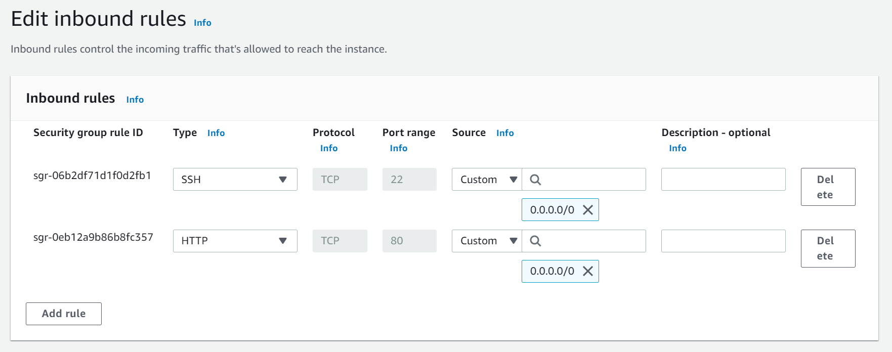
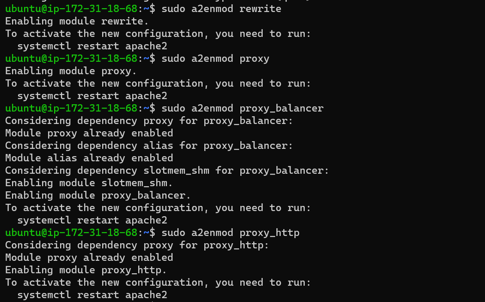
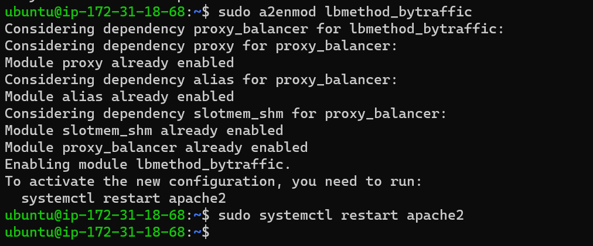
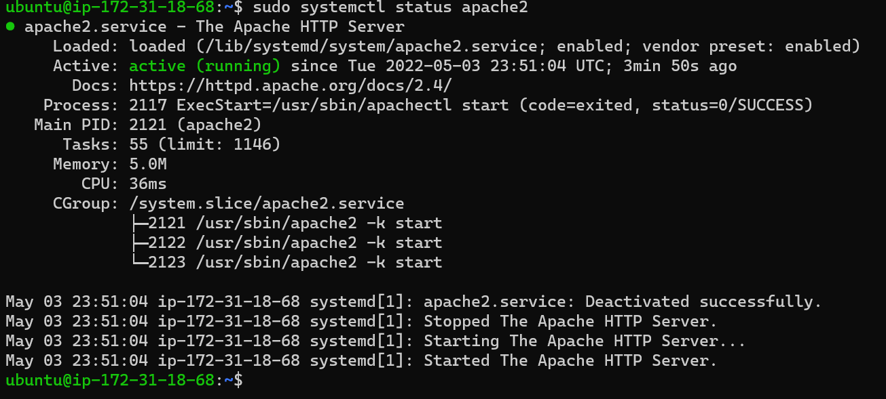
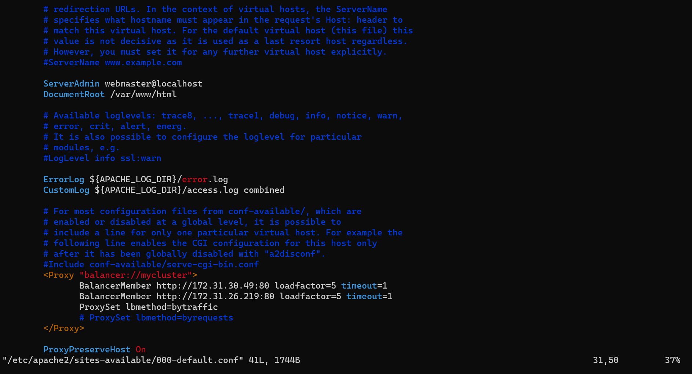
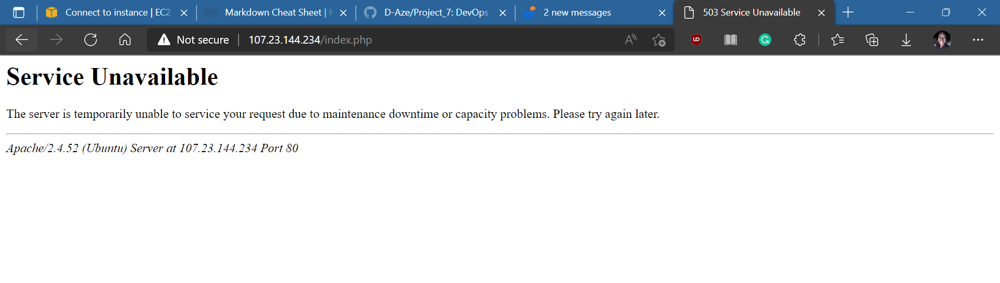
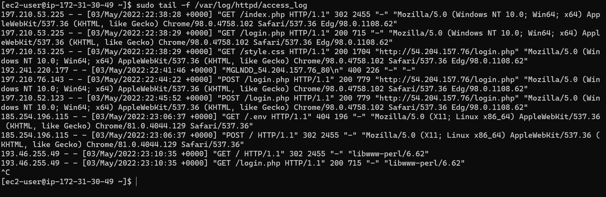
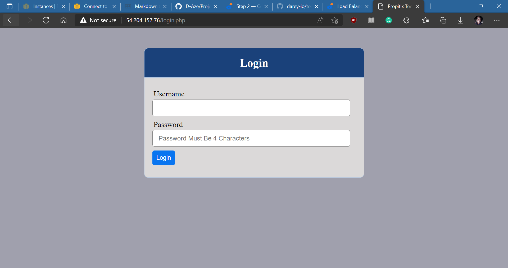

# Documentation of Project 8: Load Balancer Solution with Apache

1. Create an Ubuntu Server 20.04 EC2 instance.

2. Open TCP port 80 on Project-8-apache-lb by creating an Inbound Rule in Security Group.

3. Install Apache Load Balancer on Project-8-apache-lb server and configure it to point traffic coming to LB to both Web Servers:

#Install apache2

`sudo apt update`

`sudo apt install apache2 -y`

`sudo apt-get install libxml2-dev`

#Enable following modules:

`sudo a2enmod rewrite`

`sudo a2enmod proxy`

`sudo a2enmod proxy_balancer`

`sudo a2enmod proxy_http`

`sudo a2enmod headers`

`sudo a2enmod lbmethod_bytraffic`

Restart apache2 service: `sudo systemctl restart apache2`

Make sure apache2 is up and running: `sudo systemctl status apache2`

4. Configure load balancing: `sudo vi /etc/apache2/sites-available/000-default.conf`

#Add this configuration into this section < VirtualHost *:80 >  </ VirtualHost >

< Proxy "balancer://mycluster" >

               BalancerMember http://< WebServer1-Private-IP-Address >:80 loadfactor=5 timeout=1
               BalancerMember http://< WebServer2-Private-IP-Address >:80 loadfactor=5 timeout=1
               ProxySet lbmethod=bytraffic
               # ProxySet lbmethod=byrequests
        </ Proxy >

        ProxyPreserveHost On
        ProxyPass / balancer://mycluster/
        ProxyPassReverse / balancer://mycluster/

Restart apache server: `sudo systemctl restart apache2`

5. Verify that configuration works – try to access your LB’s public IP address or Public DNS name from your browser:
http://< Load-Balancer-Public-IP-Address-or-Public-DNS-Name >/index.php

Note: If in the Project-7 you mounted /var/log/httpd/ from your Web Servers to the NFS server – unmount them and make sure that each Web Server has its own log directory.
Open two ssh/Putty consoles for both Web Servers and run following command: `sudo tail -f /var/log/httpd/access_log`

Try to refresh your browser page http://< Load-Balancer-Public-IP-Address-or-Public-DNS-Name >/index.php several times and make sure that both servers receive HTTP GET requests from your LB – new records must appear in each server’s log file. The number of requests to each server will be approximately the same since we set loadfactor to the same value for both servers – it means that traffic will be disctributed evenly between them.

If you have configured everything correctly – your users will not even notice that their requests are served by more than one server.

Finito!
